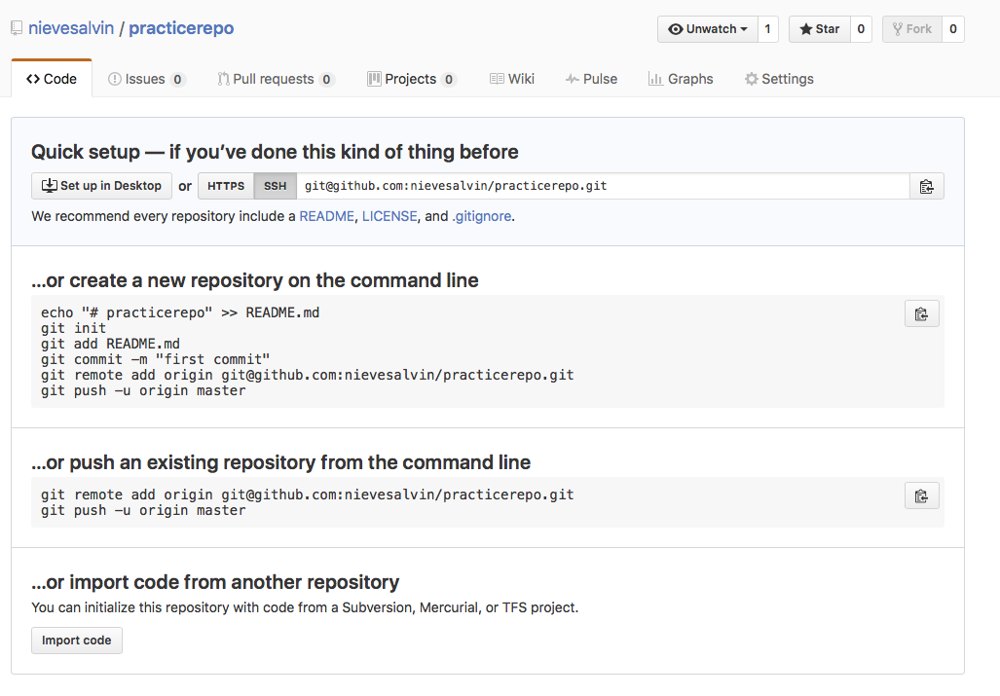
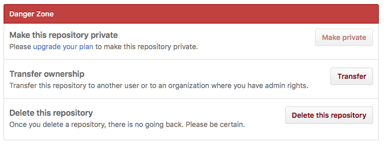

# GitHub Tutorial

_by Alvin Nieves_

---
## Git vs. GitHub
 Git is a version control software that takes "snapshots" of a programmers code  
 and keeps track of changes and modifications that have been made to the project   
 itself, while Github is a website where a programmer can send code to the cloud  
 so that the code itself lives elsewhere instead of locally. Github is also at the enter  
 of social coding, where a pethora of programmers can use eachothers' code as a  
 starting point to start their own project.  
 
 In order to work Github needs git, where as Git does not need GitHub to work  
 hence why "Git" can be found in the word "GitHub" and why "Github" is  
 not found in "Git."


---
## Initial Setup
When using Git, a programmer uses `git push` to move their code from 
a local directory to a remote repository. In order to do this, a 
programmer has to have a Github account.  

To set up a github account:
* Go to [_Github_](www.github.com)
* Click "Sign Up" and after filling out ones information click "Create Account"  
  
  
After making a Github account and a repository a programmer can 'push'
their code to the cloud and have it saved in more than just a local
directory.  
When making a github account it is important to set it 
up with SSH(Secure Socket Shell) so that one does not 
have to constantly insert their password.  
_To do this_:  
* Go to "Your profile"  
  
* Click "Settings" and then "SSH and GPG Keys"  
  
* Then copy the SSH Code and paste it to your
c9 account at the SSH tab, on the gear icon 
on the top-right of the window.

---
## Repository Setup
As a programmer, in order to be able to push ones code
to a remote repository instead of 
the code living on a single local 
directory. To be able to 'push' code
a 'repo' must be set up on GitHub.  
In order to set up a repository on 

* Go to "Your profile"  
  
* Click "Repositories"  
  
* Click "New"  
  
* Type in the name of the repository 
you want to make and press "create"  
  
* Make sure SSH is selected and Copy and paste the code from
**"or push an existing repository from
the command line."**  
  
it should look a like this:  
  
**Your repo is now set up!**  
When using a repository, a programmer must
remember to git init, in order to create  a 
link between the remote repository and the local
directory. After git has been initalized one 
should constantly 'add' and 'commit.'  


---
## Workflow & Commands
When using Git one must know all of the commands and what those 
commands tell the computer to do. Every command does
something different, and there is almost always a way to reverse what one did.  

##### Git Commands:
1._`git init`_: creates a new repository and begins to track changes and modifications in files and folders.   
```bash
nievesalvin:~/workspace/practice $ git init
Initialized empty Git repository in /home/ubuntu/workspace/practice/.git/
```
2._`git status`_: allows programmer to see what files have been modified since the last commit.  
```bash
nievesalvin:~/workspace/github-tutorial (master) $ git status
On branch master
Your branch is up-to-date with 'origin/master'.
Changes to be committed:
  (use "git reset HEAD <file>..." to unstage)

        modified:   README.md
        modified:   directions.md
        new file:   git-log-img.png
```
3._`git commit <filename> -m "message"`_:this is used in order to keep a record of the changes that a programmer has made to a file. When one uses
git commit, it takes a "snapshot" and it sets a digital checkpoint, where 
it shows, when your code last worked.  
```bash
nievesalvin:~/workspace/github-tutorial (master) $ git commit -m "add image to git log"
[master 8329a3c] add image to git log
 3 files changed, 21 insertions(+), 6 deletions(-)
 create mode 100644 git-log-img.png
```  
4._`git add`_: adds files to the "stage" so that the programmer can use `git init` in order to record changes. One 
can not commit before adding the files to the "stage."  
```bash
nievesalvin:~/workspace/github-tutorial (master) $ git add .
```
5._`git push`_: is used to send commits from the local directory to a remote 
repository that lives on the cloud.  
```bash
nievesalvin:~/workspace/github-tutorial (master) $ git push
Warning: Permanently added 'github.com,192.30.253.112' (RSA) to the list of known hosts.
Counting objects: 5, done.
Delta compression using up to 8 threads.
Compressing objects: 100% (5/5), done.
Writing objects: 100% (5/5), 48.27 KiB | 0 bytes/s, done.
Total 5 (delta 2), reused 0 (delta 0)
remote: Resolving deltas: 100% (2/2), completed with 2 local objects.
To github.com:nievesalvin/github-tutorial.git
   b0663d4..8329a3c  master -> master
```  
6._`git clone`_: is used by programmers to copy files from a remote repository
to a local one.  
7._`git diff`_: is used so that a programmer can see what specific lines of 
code have been changed in a file.
```bash
nievesalvin:~/workspace/github-tutorial (master) $ git diff
diff --git a/README.md b/README.md
index 7d064c2..2a1d90e 100644
--- a/README.md
+++ b/README.md
@@ -59,5 +59,5 @@ to a local one.
 `git diff`: is used so that a programmer can see what specific lines of 
 code have been changed in a file.  
 `git log`: is used to see the number commits, author, message, and time 
-stamp. In order to get out of git log one must simply press 'q'
+stamp. In order to get out of git log one must simply press 'q'  
 
\ No newline at end of file
```  
8._`git log`_: is used to see the number commits, author, message, and time 
stamp. In order to get out of git log one must simply press 'q'  
```bash
nievesalvin:~/workspace/github-tutorial (master) $ git log
commit b0663d40a55bb4f2c75dc90ed9292f59a1b9809f
Author: nievesalvin <alvinn4392@hstat.org>
Date:   Fri Oct 21 16:02:30 2016 +0000

    add image
```  
##### Command Line Commands
* _ls_: is short for list, and list all of the files in a directory  

* _cd -directoryname-_: cd is short for change directory and essentially it is used to 
transfer a programmer from one folder to the next.  
  
* _touch -filename-_: touch allows the programmer to create a new file   

* _mkdir_: used to make a new directory  
  
* _rm_: can be used by itself, as `rm -rf`, or `rmdir` in order to delete
files or directories with or without force.  
  
  

## Error Handling 
When using git one might forget to change into a
directory before doing `git init`, which would 
leave you with the workspace initalized.  
**Error**:   
**Correction**:   
With this error, it is best to use `ls` to see
where the `.git` is, and then use `rm -rf .git`.  
_Breakdown_:
`rm`: stands for remove  
`-rf`: stands for 'repeat' with 'force' hence the 
'rf'  
`.git`: stands for the file that is created when
git init is entered.  

A programmer can also remove a repository in both
a remote or local location. And it does not matter
which you remove first.  
_Removing a local directory_:  
* The first way of removing a local directory is 
to do.  
  
*The second way of removing a local directory is 
to do.   
  

In order to remove a remote repository, the 
programmer must go to their [github](www.github.com) account.   
* Click "Your profile"  
  
* Click "repositories"  
  
* Click on the repository you would like to select.  
* Click on "Settings"  
  
* Scroll down until you see "Danger zone and 
* click Delete Repository"  


