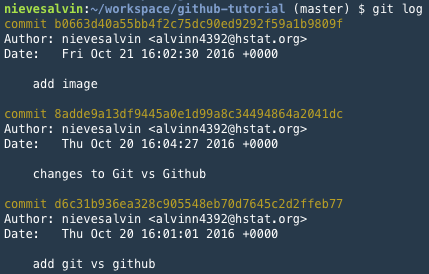

# GitHub Tutorial

_by Alvin Nieves_

---
## Git vs. GitHub
 Git is a version control software that takes "snapshots" of a programmers code  
 and keeps track of changes and modifications that have been made to the project   
 itself, while Github is a website where a programmer can send code to the cloud  
 so that the code itself lives elsewhere instead of locally. Github is also at the enter  
 of social coding, where a pethora of programmers can use eachothers' code as a  
 starting point to start their own project.  
 
 In order to work Github needs git, where as Git does not need GitHub to work  
 hence why "Git" can be found in the word "GitHub" and why "Github" is  
 not found in "Git."

---
## Initial Setup
When using Git, a programmer uses `git push` to move their code from 
a local directory to a remote repository. In order to do this, a 
programmer has to have a Github account.  

To set up a github account:
* Go to [Github](www.github.com)
* Click "Sign Up" and after filling out ones information click "Create Account"  
  

After making a Github account and a repository 

---
## Repository Setup

---
## Workflow & Commands
When using Git one must know all of the commands and what those 
commands tell the computer to do. Every command does
something different, and there is almost always a way to reverse what one did.  

##### Git Commands:
`git init`: creates a new repository and begins to track changes and modifications in files and folders. 
`git status`: allows programmer to see what files have been modified since the last commit.  
`git commit <filename> -m "message"`:this is used in order to keep a record of the changes that a programmer has made to a file. When one uses
git commit, it takes a "snapshot" and it sets a digital checkpoint, where 
it shows, when your code last worked.  
`git add`: adds files to the "stage" so that the programmer can use `git init` in order to record changes. One 
can not commit before adding the files to the "stage."  
`git push`: is used to send commits from the local directory to a remote 
repository that lives on the cloud.  
`git clone`: is used by programmers to copy files from a remote repository
to a local one.  
`git diff`: is used so that a programmer can see what specific lines of 
code have been changed in a file.  
`git log`: is used to see the number commits, author, message, and time 
stamp. In order to get out of git log one must simply press 'q'
